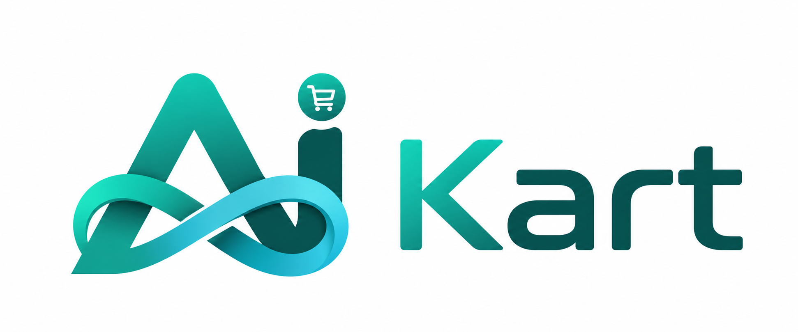

<div align="center">
  
  <h1>AI Knots Marketplace</h1>
  <p><strong>Enterprise Multi-Vendor E-Commerce Platform</strong></p>

  <p>
    
    
    
    
    
    
    
    
    
    
    
    
    
  </p>
</div>

---

## Overview

**AI Knots Marketplace** is a production-ready, multi-vendor e-commerce platform built with a modern JavaScript stack. It supports three roles — **Customer**, **Seller**, and **Admin** — with full-featured storefronts, seller dashboards, admin panels, payment processing, real-time notifications, and AI-powered features.

Built by **AI Knots IT Solutions**, the platform follows a functional dependency-injection architecture with zero ES6 classes, ensuring testability, security, and maintainability at scale.

### Key Features

- **Multi-Vendor Architecture** — Separate dashboards and workflows for customers, sellers, and admins
- **Dual Payment Gateway** — Stripe and Razorpay with sandbox/test mode support
- **Seller Payouts** — RazorpayX integration for automated seller settlements
- **Real-Time Communication** — Socket.IO for live notifications and order updates
- **AI Chatbot** — Groq-powered LLM assistant for customer support
- **Coupon & Discount Engine** — Targeted coupon distribution with customer/seller segmentation
- **Commission Engine** — Configurable commission structures per seller/category
- **Settlement Engine** — Automated ledger-based settlement with financial reconciliation
- **Invoice Generation** — PDF invoice generation via PDFKit
- **Barcode & QR Code** — Auto-generated barcodes and QR codes for products
- **Return & Refund Management** — Full return lifecycle with inventory reconciliation
- **Brand Management** — Brand request, approval, and catalog management
- **Category Requests** — Sellers can request new categories; admin approves/rejects
- **Product Moderation** — Admin review queue for seller-submitted products
- **Cookie Consent** — GDPR-compliant cookie consent management
- **Admin Reports & Analytics** — Revenue, orders, customers, and product analytics
- **Wallet System** — Seller wallet for tracking earnings and payouts
- **Referral System** — Customer referral tracking and rewards
- **Scheduled Jobs** — Automatic coupon distribution via node-cron
- **Role-Based Access Control** — JWT with granular role-based authorization

---

## Tech Stack

### Frontend

| Technology         | Purpose                          |
|--------------------|----------------------------------|
| React 18           | UI framework                     |
| TypeScript 4.9     | Type-safe JavaScript             |
| Redux Toolkit      | State management                 |
| MUI 5 (Material UI)| Component library                |
| Tailwind CSS 3     | Utility-first styling            |
| Formik + Yup       | Form handling & validation       |
| Axios              | HTTP client                      |
| React Router DOM 6 | Client-side routing              |
| Socket.IO Client   | Real-time communication          |
| Recharts           | Charts and analytics             |
| React Slick        | Carousel/slider                  |
| React Dropzone     | File upload                      |
| Day.js             | Date manipulation                |

### Backend

| Technology         | Purpose                          |
|--------------------|----------------------------------|
| Node.js 22 LTS     | JavaScript runtime (ES Modules)  |
| Express 5          | HTTP framework                   |
| MongoDB + Mongoose | Database & ODM                   |
| JSON Web Token     | Authentication & authorization   |
| Socket.IO          | Real-time bidirectional events   |
| Pino + Pino-HTTP   | Structured logging               |
| Helmet             | Security headers                 |
| Morgan             | HTTP request logging             |
| Compression        | Gzip response compression        |
| Cookie Parser      | Cookie management                |
| CORS               | Cross-origin resource sharing    |
| Multer             | Multipart file upload handling   |
| node-cron          | Background scheduled jobs        |
| Joi (via env.js)   | Environment validation           |

### Payment

| Gateway    | Integration                        |
|------------|------------------------------------|
| **Stripe** | Cards, payment intents             |
| **Razorpay** | Orders, payments, webhooks      |
| **RazorpayX** | Seller payouts, settlements    |

### Storage & Media

| Service      | Purpose                           |
|--------------|-----------------------------------|
| Cloudinary   | Image upload, transformation, CDN |

### Email

| Service   | Purpose                           |
|-----------|-----------------------------------|
| Nodemailer| SMTP email delivery                |

### AI

| Service | Purpose                            |
|---------|------------------------------------|
| Groq API | LLM-powered AI chatbot (Llama 3.3 70B) |

### Reporting & Documents

| Library   | Purpose                           |
|-----------|-----------------------------------|
| PDFKit    | Invoice PDF generation            |
| ExcelJS   | Excel report export               |
| bwip-js   | Barcode generation                |
| jsbarcode | SVG/Canvas barcode rendering      |
| qrcode    | QR code generation                |

### Testing

| Framework | Purpose                           |
|-----------|-----------------------------------|
| Jest 29   | Unit & integration tests           |
| Supertest | HTTP assertion testing            |

---

## Project Architecture

```
┌─────────────────────────────────────────────────────────────────────┐
│                        FRONTEND (React 18 + TS)                      │
│  ┌──────────┐  ┌──────────┐  ┌──────────┐  ┌────────────────────┐  │
│  │ Customer │  │  Seller  │  │  Admin   │  │  Shared Components │  │
│  │  Routes  │  │  Routes  │  │  Routes  │  │  (Nav, Footer,     │  │
│  │          │  │          │  │          │  │   Notifications)   │  │
│  └────┬─────┘  └────┬─────┘  └────┬─────┘  └────────────────────┘  │
│       │              │              │                                │
│  ┌────┴──────────────┴──────────────┴────────────────────────────┐  │
│  │                  Redux Toolkit Store                           │  │
│  │  (Auth, Cart, Products, Orders, Seller, Admin slices)         │  │
│  └──────────────────────────────┬─────────────────────────────────┘  │
│                                 │                                    │
│  ┌──────────────────────────────┴─────────────────────────────────┐  │
│  │                 Axios HTTP Client (api.ts)                      │  │
│  │              Base URL: http://localhost:5000                    │  │
│  └──────────────────────────────┬─────────────────────────────────┘  │
└─────────────────────────────────┼───────────────────────────────────┘
                                  │ HTTP / WebSocket
                                  ▼
┌─────────────────────────────────────────────────────────────────────┐
│                     BACKEND (Express 5 + Node.js 22)                 │
│                                                                      │
│  ┌────────────────────────────────────────────────────────────────┐  │
│  │                    Middleware Stack                             │  │
│  │  Helmet → CORS → Compression → Morgan → JSON → Cookie Parser  │  │
│  └──────────────────────────────┬─────────────────────────────────┘  │
│                                 │                                    │
│  ┌──────────────────────────────┴─────────────────────────────────┐  │
│  │                    Route Modules (46 modules)                   │  │
│  │  /api/auth → AuthController → AuthService → Repositories       │  │
│  │  /api/products → ProductController → ProductService → ...      │  │
│  │  /api/orders → OrderController → OrderService → ...           │  │
│  │  /api/payments → PaymentController → PaymentService → ...     │  │
│  └──────────────────────────────┬─────────────────────────────────┘  │
│                                 │                                    │
│  ┌──────────────────────────────┴─────────────────────────────────┐  │
│  │                  Service Layer (Business Logic)                 │  │
│  │  Auth, Seller, Product, Cart, Order, Payment, Coupon, Return,  │  │
│  │  Review, Notification, AI, Deal, Transaction, Reports, etc.    │  │
│  └──────────────────────────────┬─────────────────────────────────┘  │
│                                 │                                    │
│  ┌──────────────────────────────┴─────────────────────────────────┐  │
│  │              Repository Layer (Data Access)                     │  │
│  │  UserRepo, SellerRepo, ProductRepo, OrderRepo, CartRepo, ...   │  │
│  └──────────────────────────────┬─────────────────────────────────┘  │
└─────────────────────────────────┼───────────────────────────────────┘
                                  │
          ┌───────────────────────┼───────────────────────┐
          ▼                       ▼                       ▼
┌─────────────────┐   ┌─────────────────────┐   ┌───────────────────┐
│     MongoDB     │   │   Third-Party APIs   │   │     Services      │
│   (Atlas/Local) │   │  ┌───────────────┐   │   │  ┌─────────────┐  │
│  Collections:   │   │  │ Stripe        │   │   │  │ Cloudinary  │  │
│  users, sellers, │   │  │ Razorpay      │   │   │  │ Nodemailer │  │
│  products,      │   │  │ RazorpayX     │   │   │  │ Groq AI    │  │
│  orders,        │   │  │ Cloudinary    │   │   │  │ Socket.IO  │  │
│  payments, etc. │   │  └───────────────┘   │   │  └─────────────┘  │
└─────────────────┘   └─────────────────────┘   └───────────────────┘
```

### Authentication Flow

```
1. User registers/logs in → Backend validates credentials
2. Backend returns JWT access token (5d expiry) + refresh token (7d expiry)
3. Access token stored in localStorage as "jwt"
4. Refresh token stored in HttpOnly cookie for rotation
5. On expiry, refresh token endpoint issues new access token
6. Roles: ROLE_CUSTOMER, ROLE_SELLER, ROLE_ADMIN
```

### Payment Flow

```
1. Customer places order → PaymentOrder created with status PENDING
2. Frontend initializes Stripe/Razorpay SDK with backend-generated keys
3. Customer completes payment on gateway page
4. Gateway redirects to /payment-success with transaction details
5. Backend verifies payment signature via webhook or direct verification
6. On success: Order status → PLACED, PaymentOrder status → CAPTURED
7. On failure: Order status → PAYMENT_FAILED
8. Settlement engine processes seller payouts via RazorpayX
```

---

## Folder Structure

```
AI-Knots-Marketplace/
├── SourceCode/
│   ├── frontend/                          # React + TypeScript application
│   │   ├── public/                        # Static assets, index.html
│   │   ├── src/
│   │   │   ├── admin/                     # Admin panel pages & components
│   │   │   │   ├── components/            # Admin-specific components
│   │   │   │   └── pages/                 # Admin page modules (19 modules)
│   │   │   ├── components/                # Shared UI components
│   │   │   │   └── shared/                # NotificationProvider, SocketEventHandler
│   │   │   ├── Config/                    # API config (api.ts), branding config
│   │   │   ├── customer/                  # Customer-facing pages & components
│   │   │   │   ├── components/            # Navbar, Footer, CookieBanner
│   │   │   │   ├── pages/                 # Home, Products, Cart, Auth, etc. (15 modules)
│   │   │   │   └── util/                  # Customer-specific utilities
│   │   │   ├── data/                      # Static data (banners, filters, categories)
│   │   │   ├── hooks/                     # Custom hooks (useSocket, useCookieConsent)
│   │   │   ├── Redux Toolkit/             # Redux state management
│   │   │   │   ├── Admin/                 # Admin Redux slices (17 slices)
│   │   │   │   ├── Customer/              # Customer Redux slices (12 slices)
│   │   │   │   ├── Seller/                # Seller Redux slices (12 slices)
│   │   │   │   └── Store.ts               # Root store configuration
│   │   │   ├── routes/                    # Route definitions (Customer, Seller, Admin)
│   │   │   ├── seller/                    # Seller dashboard pages & components
│   │   │   │   ├── components/            # Seller-specific components
│   │   │   │   └── pages/                 # Seller page modules (13 modules)
│   │   │   ├── services/                  # API service modules (socket, notifications)
│   │   │   ├── Theme/                     # MUI custom theme
│   │   │   ├── types/                     # TypeScript type definitions (29 files)
│   │   │   └── util/                      # Shared utilities (cart, upload, formatters)
│   │   ├── .env                           # Frontend environment variables
│   │   ├── package.json
│   │   └── tsconfig.json
│   │
│   └── backend/                           # Node.js + Express API server
│       ├── src/
│       │   ├── app.js                     # Application assembly (DI container)
│       │   ├── server.js                  # HTTP server bootstrap
│       │   ├── config/                    # Environment, branding, cookie config
│       │   ├── constants/                 # Application constants
│       │   ├── database/                  # MongoDB connection, seed scripts
│       │   │   └── seed-data/             # Seed data files
│       │   ├── integrations/              # Third-party service adapters
│       │   │   ├── cloudinary/            # Cloudinary client
│       │   │   ├── email/                 # Nodemailer client
│       │   │   ├── payment/               # Stripe & Razorpay clients, gateway factory
│       │   │   └── razorpayx/             # RazorpayX payout client
│       │   ├── middlewares/               # Auth, roles, error handler, upload
│       │   ├── modules/                   # Feature modules (46 modules)
│       │   │   ├── admin/                 # Admin management
│       │   │   ├── adminCoupon/           # Admin coupon management
│       │   │   ├── adminDashboard/        # Admin dashboard analytics
│       │   │   ├── adminNotifications/    # Admin notification center
│       │   │   ├── adminOrder/            # Admin order management
│       │   │   ├── adminReports/          # Admin reports & analytics
│       │   │   ├── adminUser/             # Admin user management
│       │   │   ├── ai/                    # AI chatbot (Groq)
│       │   │   ├── auth/                  # Authentication & OTP
│       │   │   ├── brandRequests/         # Brand request workflow
│       │   │   ├── brands/                # Brand catalog
│       │   │   ├── cart/                  # Shopping cart
│       │   │   ├── categories/            # Category management
│       │   │   ├── categoryRequests/      # Category request workflow
│       │   │   ├── commissions/           # Commission engine
│       │   │   ├── cookieConsent/         # GDPR cookie consent
│       │   │   ├── couponDistribution/    # Targeted coupon distribution
│       │   │   ├── coupons/               # Coupon campaigns
│       │   │   ├── customerSegmentation/  # Customer segmentation
│       │   │   ├── deals/                 # Deal management
│       │   │   ├── gateway/               # Payment gateway webhooks
│       │   │   ├── health/                # Health check endpoint
│       │   │   ├── home/                  # Homepage merchandising
│       │   │   ├── invoice/               # PDF invoice generation
│       │   │   ├── notifications/         # Multi-channel notifications
│       │   │   ├── orders/                # Order management
│       │   │   ├── payments/              # Payment processing
│       │   │   ├── payouts/               # Seller payout management
│       │   │   ├── productModeration/     # Product moderation queue
│       │   │   ├── products/              # Product catalog
│       │   │   ├── referrals/             # Referral system
│       │   │   ├── reports/               # Seller revenue reports
│       │   │   ├── returns/               # Return & refund management
│       │   │   ├── reviews/               # Product reviews
│       │   │   ├── sellerCoupon/          # Seller coupon management
│       │   │   ├── sellerDashboard/       # Seller dashboard analytics
│       │   │   ├── sellerSegmentation/    # Seller segmentation
│       │   │   ├── sellerVerification/    # Seller KYC verification
│       │   │   ├── sellers/               # Seller profile management
│       │   │   ├── settlementEngine/      # Financial ledger & reconciliation
│       │   │   ├── settlements/           # Settlement history
│       │   │   ├── systemSettings/        # System configuration
│       │   │   ├── transactions/          # Transaction ledger
│       │   │   ├── uploads/               # Media upload
│       │   │   ├── users/                 # Customer user management
│       │   │   └── wishlist/              # Wishlist management
│       │   ├── services/                  # Shared services (socket, scheduler, config)
│       │   └── utils/                     # Utilities (JWT, OTP, mappers, SKU generator)
│       ├── uploads/                       # Local file uploads directory
│       ├── .env                           # Backend environment variables
│       └── package.json
│
├── README.md                             # This file
```

---

## Prerequisites

| Requirement     | Version / Notes                          |
|-----------------|------------------------------------------|
| **Node.js**     | >= 22.0.0 (LTS recommended)             |
| **npm**         | >= 10.x (ships with Node.js)            |
| **MongoDB**     | 7.0+ (local or [MongoDB Atlas](https://www.mongodb.com/atlas)) |
| **Git**         | Latest                                   |
| **OS**          | Windows, macOS, or Linux                 |

### Required Third-Party Accounts

You need to create accounts and obtain credentials for the following services (sandbox/test modes supported):

| Service        | What You Need                          | Free Tier?                     |
|----------------|----------------------------------------|--------------------------------|
| **Cloudinary** | Cloud name, API key, API secret        | Yes (free tier)                |
| **Stripe**     | Publishable key, Secret key            | Yes (test mode)                |
| **Razorpay**   | Key ID, Key Secret                     | Yes (test mode)                |
| **RazorpayX**  | Key ID, Key Secret (optional for payouts) | Yes (test mode)            |
| **Groq**       | API key                                | Yes (free tier)                |
| **SMTP**       | SMTP host, port, user, pass            | Gmail App Password or any SMTP |

---

## Clone Repository

```bash
git clone https://github.com/YOUR_USERNAME/AI-Knots-Marketplace.git
cd AI-Knots-Marketplace
```

---

## Installation

### Backend

```bash
cd SourceCode/backend
npm install
```

### Frontend

```bash
cd SourceCode/frontend
npm install
```

---

## Environment Variables

### Backend (`SourceCode/backend/.env`)

Create the file by copying the template below — **do not commit secrets to Git**.

```bash
# Copy the existing .env (already present in dev) or create a new one
cp .env .env.backup  # backup existing if needed
```

| Variable                     | Required | Purpose                                    | Example                                    |
|------------------------------|----------|--------------------------------------------|--------------------------------------------|
| `NODE_ENV`                   | No       | Runtime environment                        | `development`                              |
| `PORT`                       | No       | API server port                            | `5000`                                     |
| `API_BASE_URL`               | No       | Public API base URL                        | `http://localhost:5000`                    |
| `FRONTEND_URL`               | **Yes**  | CORS allowed origin                        | `http://localhost:3000`                    |
| `LOG_LEVEL`                  | No       | Pino log level                             | `info`                                     |
| `MONGODB_URI`                | **Yes**  | MongoDB connection string                  | `mongodb://127.0.0.1:27017/ecommerce_multivendor` |
| `JWT_ACCESS_SECRET`          | **Yes**  | JWT access token signing secret            | (64-char hex string)                       |
| `JWT_REFRESH_SECRET`         | **Yes**  | JWT refresh token signing secret           | (64-char hex string)                       |
| `JWT_ACCESS_EXPIRES_IN`      | No       | Access token expiry                        | `5d`                                       |
| `JWT_REFRESH_EXPIRES_IN`     | No       | Refresh token expiry                       | `7d`                                       |
| `CORS_ORIGINS`               | No       | Comma-separated allowed origins            | `http://localhost:3000`                    |
| `CLOUDINARY_CLOUD_NAME`      | **Yes**  | Cloudinary cloud name                      | `your-cloud`                               |
| `CLOUDINARY_API_KEY`         | **Yes**  | Cloudinary API key                         | `123456789012345`                          |
| `CLOUDINARY_API_SECRET`      | **Yes**  | Cloudinary API secret                      | `abc123def456`                             |
| `RAZORPAY_KEY_ID`            | **Yes**  | Razorpay key ID                            | `rzp_test_xxxxxxxxxxxx`                    |
| `RAZORPAY_KEY_SECRET`        | **Yes**  | Razorpay key secret                        | `xxxxxxxxxxxxxxxx`                         |
| `STRIPE_SECRET_KEY`          | **Yes**  | Stripe secret key                          | `sk_test_xxxxxxxxxxxxxxxx`                 |
| `STRIPE_PUBLISHABLE_KEY`     | No       | Stripe publishable key                     | `pk_test_xxxxxxxxxxxxxxxx`                 |
| `RAZORPAYX_KEY_ID`           | No       | RazorpayX key ID (seller payouts)          | `rzpx_xxxxxxxxxxxx`                        |
| `RAZORPAYX_KEY_SECRET`       | No       | RazorpayX key secret                       | `xxxxxxxxxxxxxxxx`                         |
| `SMTP_HOST`                  | No       | SMTP server host                           | `smtp.gmail.com`                           |
| `SMTP_PORT`                  | No       | SMTP server port                           | `587`                                      |
| `SMTP_USER`                  | No       | SMTP username                              | `your-email@gmail.com`                     |
| `SMTP_PASS`                  | No       | SMTP password / App Password               | `xxxx xxxx xxxx xxxx`                      |
| `EMAIL_FROM`                 | No       | Sender email address                       | `noreply@example.com`                      |
| `GROQ_API_KEY`               | **Yes**  | Groq API key for AI chatbot                | `gsk_xxxxxxxxxxxxxxxx`                     |
| `GROQ_MODEL`                 | **Yes**  | Groq model ID                              | `llama-3.3-70b-versatile`                  |
| `MOCK_PAYOUT_FAILURE_RATE`   | No       | Simulate payout failures (0-100)           | `0`                                        |
| `MOCK_REFUND_FAILURE_RATE`   | No       | Simulate refund failures (0-100)           | `0`                                        |

> **Important**: Generate strong JWT secrets using `openssl rand -hex 32` (macOS/Linux) or `node -e "console.log(require('crypto').randomBytes(32).toString('hex'))"`.

<!-- ### Frontend (`SourceCode/frontend/.env`)

| Variable                      | Required | Purpose                            | Example                            |
|-------------------------------|----------|------------------------------------|------------------------------------|
| `REACT_APP_NAME`              | No       | Platform display name              | `AI Knots Marketplace`             |
| `REACT_APP_COMPANY_NAME`      | No       | Company name                       | `AI Knots IT Solutions`            |
| `REACT_APP_SUPPORT_EMAIL`     | No       | Support email displayed in UI      | `support@aiknotsit.com`            |
| `REACT_APP_WEBSITE`           | No       | Company website URL                | `https://aiknotsit.com`            |
| `REACT_APP_COPYRIGHT`         | No       | Copyright notice                    | `© AI Knots IT Solutions`          |
| `REACT_APP_LOGO_URL`          | No       | Logo image URL                     | `/Ai-kart-logo.png`                |
| `REACT_APP_SOCIAL_FACEBOOK`   | No       | Facebook page URL                  | `https://facebook.com/...`         |
| `REACT_APP_SOCIAL_TWITTER`    | No       | Twitter/X profile URL              | `https://twitter.com/...`          |
| `REACT_APP_SOCIAL_INSTAGRAM`  | No       | Instagram profile URL              | `https://instagram.com/...`        |
| `REACT_APP_SOCIAL_LINKEDIN`   | No       | LinkedIn page URL                  | `https://linkedin.com/...`         | -->

---

## Running the Project

### Development Mode

#### 1. Start MongoDB

Ensure MongoDB is running locally or use a MongoDB Atlas connection string.

```bash
# Local MongoDB (default)
mongod
```

#### 2. Start Backend Server

```bash
cd SourceCode/backend
npm run dev
```

The backend starts at **http://localhost:5000** with auto-restart on file changes (using Node.js `--watch` flag).

#### 3. Seed Initial Data (Optional)

```bash
# Seed categories
npm run seed:categories

# Seed home page categories
npm run seed:home-categories
```

#### 4. Start Frontend

```bash
cd SourceCode/frontend
npm start
```

The frontend starts at **http://localhost:3000** with hot reload.

### Production Build

#### Backend

```bash
cd SourceCode/backend
npm start     # or use PM2: pm2 start src/server.js --name marketplace-api
```

#### Frontend

```bash
cd SourceCode/frontend
npm run build
# Serve the build/ folder via Nginx, Apache, or any static server
```

---

## Available Scripts

### Backend (`SourceCode/backend/package.json`)

| Script              | Command                                          | Description                             |
|---------------------|--------------------------------------------------|-----------------------------------------|
| `npm start`         | `node src/server.js`                             | Start production server                 |
| `npm run dev`       | `node --watch src/server.js`                     | Start dev server with auto-restart      |
| `npm test`          | `node --experimental-vm-modules jest --runInBand --detectOpenHandles` | Run test suite       |
| `npm run seed:categories` | `node src/database/seedCategories.js`      | Seed categories into database           |

### Frontend (`SourceCode/frontend/package.json`)

| Script          | Command                   | Description                          |
|-----------------|---------------------------|--------------------------------------|
| `npm start`     | `react-scripts start`     | Start dev server (port 3000)        |
| `npm run build` | `react-scripts build`     | Production build to `build/` folder |
| `npm test`      | `react-scripts test`      | Run test suite                      |
| `npm run eject` | `react-scripts eject`     | Eject CRA configuration (irreversible) |

---

## Default URLs

| Service          | URL                              |
|------------------|----------------------------------|
| **Frontend**     | http://localhost:3000            |
| **Backend API**  | http://localhost:5000            |
| **Health Check** | http://localhost:5000/health     |
| **API Gateway**  | http://localhost:5000/           |

---

## Authentication

### Customer

- **Register**: Email + OTP verification
- **Login**: Email + password → JWT access token
- **Password Reset**: Email OTP flow
- **Role**: `ROLE_CUSTOMER`

### Seller

- Separate registration flow with business details
- KYC verification by admin before activation
- **Role**: `ROLE_SELLER`

### Admin

- Pre-seeded admin login at `/admin-login`
- Full access to all management modules
- **Role**: `ROLE_ADMIN`

### JWT Token Management

- **Access Token**: Short-lived (default 5 days), stored in `localStorage` as `jwt`
- **Refresh Token**: Longer-lived (default 7 days), stored in HttpOnly cookie
- Automatic token refresh on 401 responses via refresh token rotation

---

## Marketplace Modules

| Module                   | Customer | Seller | Admin |
|--------------------------|:--------:|:------:|:-----:|
| Authentication & OTP     |    ✓     |   ✓    |   ✓   |
| Product Catalog          |    ✓     |   ✓    |   ✓   |
| Categories               |    ✓     |   ✓    |   ✓   |
| Brands                   |    ✓     |   ✓    |   ✓   |
| Cart                     |    ✓     |        |       |
| Wishlist                 |    ✓     |        |       |
| Checkout & Address       |    ✓     |        |       |
| Orders                   |    ✓     |   ✓    |   ✓   |
| Payments (Stripe/Razorpay)|   ✓     |        |   ✓   |
| Coupons                  |    ✓     |   ✓    |   ✓   |
| Reviews & Ratings        |    ✓     |        |   ✓   |
| Returns & Refunds        |    ✓     |   ✓    |   ✓   |
| Seller Dashboard         |          |   ✓    |       |
| Seller Wallet            |          |   ✓    |       |
| Seller Commissions       |          |   ✓    |   ✓   |
| Seller Payouts           |          |   ✓    |   ✓   |
| Inventory Management     |          |   ✓    |       |
| Product Moderation       |          |        |   ✓   |
| Seller Verification (KYC)|          |   ✓    |   ✓   |
| Admin Dashboard          |          |        |   ✓   |
| Admin Reports & Analytics|          |        |   ✓   |
| Admin User Management    |          |        |   ✓   |
| Admin Notifications      |          |        |   ✓   |
| System Settings          |          |        |   ✓   |
| Cookie Consent (GDPR)    |    ✓     |        |   ✓   |
| AI Chatbot               |    ✓     |        |       |
| Referral System          |    ✓     |        |       |
| Invoice Generation       |    ✓     |   ✓    |   ✓   |
| Deal Management          |    ✓     |        |   ✓   |
| Home Page Merchandising  |    ✓     |        |   ✓   |
| Customer Segmentation    |          |        |   ✓   |
| Seller Segmentation      |          |        |   ✓   |
| Settlement Engine        |          |   ✓    |   ✓   |
| Coupon Distribution Engine|         |        |   ✓   |

---

## Payment Integration

### Stripe (Test Mode)

1. Create a [Stripe account](https://dashboard.stripe.com/register)
2. Get test keys from **Dashboard → Developers → API Keys**
3. Set `STRIPE_SECRET_KEY` (sk_test_...) and `STRIPE_PUBLISHABLE_KEY` (pk_test_...) in `.env`
4. Use test card `4242 4242 4242 4242` with any future expiry and CVC

### Razorpay (Test Mode)

1. Create a [Razorpay account](https://dashboard.razorpay.com/)
2. Get test keys from **Dashboard → Settings → API Keys**
3. Set `RAZORPAY_KEY_ID` and `RAZORPAY_KEY_SECRET` in `.env`
4. Use test UPI/cards from [Razorpay Test Cards](https://razorpay.com/docs/payments/payment-gateway/test-card-details/)

### RazorpayX (Seller Payouts - Optional)

1. Enable RazorpayX in your Razorpay dashboard
2. Set `RAZORPAYX_KEY_ID` and `RAZORPAYX_KEY_SECRET`
3. Payouts route through the gateway with webhook verification

### Mock Gateway (Development)

By default, the backend registers mock gateways (`mock_razorpay`, `mock_razorpayx`) that simulate payouts and refunds without real transactions. Configure failure rates via:

```env
MOCK_PAYOUT_FAILURE_RATE=0            # 0-100 percent chance of failure
MOCK_REFUND_FAILURE_RATE=0            # 0-100 percent chance of failure
DEFAULT_PAYOUT_PROVIDER=mock_razorpayx
DEFAULT_REFUND_PROVIDER=mock_razorpay
```

---

## Email Configuration

The platform uses **Nodemailer** with SMTP for transactional emails (OTP, order confirmation, notifications).

### Gmail Setup (Recommended for Development)

1. Enable [2-Factor Authentication](https://myaccount.google.com/security) on your Gmail account
2. Generate an [App Password](https://myaccount.google.com/apppasswords)
3. Configure in `.env`:

```env
SMTP_HOST=smtp.gmail.com
SMTP_PORT=587
SMTP_USER=your-email@gmail.com
SMTP_PASS=your-16-char-app-password
EMAIL_FROM=your-email@gmail.com
```

### Other SMTP Providers

For production, use **SendGrid**, **Mailgun**, **Amazon SES**, or any SMTP provider:

```env
SMTP_HOST=smtp.sendgrid.net
SMTP_PORT=587
SMTP_USER=apikey
SMTP_PASS=SG.xxxxxxxxxxxx
EMAIL_FROM=noreply@yourdomain.com
```

---

## Cloud Storage

All media uploads (product images, brand logos, profile pictures) are handled by **Cloudinary**.

1. Create a [Cloudinary account](https://cloudinary.com/users/register/free) (free tier: 25 GB storage, 25 GB bandwidth)
2. Get credentials from **Dashboard**
3. Configure in `.env`:

```env
CLOUDINARY_CLOUD_NAME=your-cloud-name
CLOUDINARY_API_KEY=123456789012345
CLOUDINARY_API_SECRET=abc123def456
```

---

## Database

### Connection

The backend connects to MongoDB via Mongoose. Supports both local and Atlas connections.

**Local**: `mongodb://127.0.0.1:27017/ecommerce_multivendor`

**Atlas**: `mongodb+srv://<user>:<password>@<cluster>.mongodb.net/ecommerce_multivendor`

### Key Collections

| Collection            | Purpose                            |
|-----------------------|------------------------------------|
| `users`               | Customer accounts                  |
| `sellers`             | Seller profiles & KYC              |
| `products`            | Product catalog                    |
| `categories`          | Category tree                      |
| `brands`              | Brand catalog                      |
| `carts`               | Active shopping carts              |
| `orders`              | Order records                      |
| `paymentorders`       | Payment transactions               |
| `transactions`        | Financial transaction ledger       |
| `coupons`             | Discount coupon campaigns          |
| `couponassignments`   | Distributed coupon records         |
| `reviews`             | Product reviews & ratings          |
| `wishlists`           | User wishlists                     |
| `returns`             | Return/refund requests             |
| `refunds`             | Refund records                     |
| `notifications`       | In-app notification history        |
| `commissions`         | Seller commission records          |
| `payouts`             | Seller payout records              |
| `settlements`         | Settlement history                 |
| `ledgerentries`       | Financial ledger (double-entry)    |
| `deals`               | Campaign deals                     |
| `homecategories`      | Homepage category merchandising    |
| `brandrequests`       | Brand creation requests            |
| `categoryrequests`    | Category creation requests         |
| `sellerreports`       | Seller revenue reports             |
| `referrals`           | Customer referral tracking         |
| `systemsettings`      | Global platform configuration      |

### Seed Data

```bash
cd SourceCode/backend
npm run seed:categories           # Seed product categories
# Home categories are auto-seeded on server start
```

---

## Common Development Workflow

```bash
# 1. Create a feature branch
git checkout -b feature/your-feature-name

# 2. Make changes and test
# Backend
cd SourceCode/backend && npm run dev
# Frontend (separate terminal)
cd SourceCode/frontend && npm start

# 3. Run tests
cd SourceCode/backend && npm test
cd SourceCode/frontend && npm test

# 4. Commit changes
git add .
git commit -m "feat: add your feature description"

# 5. Push and create PR
git push origin feature/your-feature-name
```

### Branch Naming Convention

- `feature/description` — New features
- `fix/description` — Bug fixes
- `chore/description` — Maintenance tasks
- `refactor/description` — Code refactoring
- `docs/description` — Documentation updates

---

## Troubleshooting

### Port Already in Use

```bash
# Find process on port
netstat -ano | findstr :5000    # Windows
lsof -i :5000                    # macOS/Linux

# Kill process
taskkill /PID <PID> /F           # Windows
kill -9 <PID>                     # macOS/Linux
```

### Missing Environment Variables

If the backend fails to start with a CLI error about missing variables, ensure all required keys in `REQUIRED_ENV_VARS` (defined in `src/config/env.js`) are present in your `.env` file:

```
MONGODB_URI
CLOUDINARY_CLOUD_NAME
CLOUDINARY_API_KEY
CLOUDINARY_API_SECRET
RAZORPAY_KEY_ID
RAZORPAY_KEY_SECRET
STRIPE_SECRET_KEY
GROQ_API_KEY
GROQ_MODEL
FRONTEND_URL
```

### Database Connection Issues

```bash
# Test MongoDB connection
mongosh "mongodb://127.0.0.1:27017"

# Check Atlas whitelist (Network Access → IP Whitelist)
# Ensure your current IP is allowed
```

### Payment Gateway Issues

- **Stripe**: Verify test keys are `sk_test_...` and `pk_test_...` (not `sk_live_...`)
- **Razorpay**: Ensure test mode is enabled in Razorpay dashboard
- **Webhooks**: Use [ngrok](https://ngrok.com/) `ngrok http 5000` for local webhook testing

### SMTP Issues

- Gmail requires an [App Password](https://myaccount.google.com/apppasswords) (not your regular password)
- For development, leave SMTP variables empty; the backend falls back to `ethereal.email` mock

### Cloudinary Issues

- Verify cloud name, API key, and API secret are correct
- Check Cloudinary dashboard for unsigned upload settings

### Build Failures

```bash
# Clear caches and retry
cd SourceCode/frontend
rm -rf node_modules build
npm install
npm run build
```

---

## Production Deployment

### Considerations

1. **Environment Variables**: Use a secrets manager (AWS Secrets Manager, HashiCorp Vault) or CI/CD pipeline secrets
2. **MongoDB**: Use MongoDB Atlas with IP whitelist and VPC peering
3. **Process Manager**: Use PM2 with cluster mode:
   ```bash
   npm install -g pm2
   pm2 start src/server.js --name marketplace-api -i max
   pm2 startup
   pm2 save
   ```
4. **Reverse Proxy**: Nginx or Caddy in front of the Node.js server
5. **SSL/TLS**: Enforce HTTPS via Let's Encrypt or cloud load balancer
6. **Frontend**: Serve the `build/` folder via Nginx or deploy to Vercel/Netlify
7. **Logging**: Configure Pino to write to a log aggregation service (ELK, Datadog, etc.)
8. **Monitoring**: Set up health check monitoring at `/health`
9. **Rate Limiting**: Add `express-rate-limit` for production API endpoints
10. **CORS**: Restrict `CORS_ORIGINS` to your actual frontend domain

### Example Nginx Configuration

```nginx
server {
    listen 80;
    server_name yourdomain.com;
    return 301 https://$server_name$request_uri;
}

server {
    listen 443 ssl;
    server_name yourdomain.com;

    ssl_certificate /etc/letsencrypt/live/yourdomain.com/fullchain.pem;
    ssl_certificate_key /etc/letsencrypt/live/yourdomain.com/privkey.pem;

    location / {
        root /var/www/frontend/build;
        try_files $uri /index.html;
    }

    location /api/ {
        proxy_pass http://127.0.0.1:5000;
        proxy_http_version 1.1;
        proxy_set_header Upgrade $http_upgrade;
        proxy_set_header Connection 'upgrade';
        proxy_set_header Host $host;
        proxy_set_header X-Real-IP $remote_addr;
        proxy_cache_bypass $http_upgrade;
    }
}
```

---

## Security Notes

- **Never commit `.env` files** — both backend and frontend `.env` files are in `.gitignore`
- **Rotate secrets** — Change JWT secrets and API keys regularly, especially after team changes
- **Use HTTPS** — Always serve the application over HTTPS in production
- **Validate webhooks** — Always verify webhook signatures from Stripe/Razorpay
- **CORS** — Restrict allowed origins in production
- **Rate limiting** — Implement rate limiting on auth and API endpoints
- **Input validation** — All API inputs are validated; never trust client data
- **Sessions** — JWT refresh tokens are stored in HttpOnly, Secure cookies
- **File uploads** — Multer configured with file size limits and type restrictions

---

## Contributing Guidelines

### Branch Naming

```
feature/description        # New features
fix/description            # Bug fixes
refactor/description       # Code refactoring
docs/description           # Documentation
chore/description          # Maintenance
```

### Commit Message Format

Follow [Conventional Commits](https://www.conventionalcommits.org/):

```
feat: add seller payout webhook handler
fix: resolve cart quantity overflow on concurrent requests
refactor: extract payment gateway factory from app.js
docs: update API endpoint documentation
chore: upgrade mongoose to v8.10
```

### Code Style

- Backend: ES Modules (`import`/`export`), functional patterns (no classes)
- Frontend: TypeScript, functional components with hooks
- Run `npm test` before submitting a PR
- Ensure no secrets or credentials are included in commits

---

## License

This project is **proprietary software** owned by **AI Knots IT Solutions**. All rights reserved.

---

## Maintainer

| Detail         | Information                            |
|----------------|----------------------------------------|
| **Project**    | AI Knots Marketplace                   |
| **Company**    | AI Knots IT Solutions                  |
| **Developer**  | Jeet Ahirwar                           |
| **Email**      | support@aiknotsit.com                  |
| **Website**    | https://aiknotsit.com                  |
| **GitHub**     | https://github.com/JeetAhirwar         |

---

<div align="center">
  <sub>Built with ❤️ by AI Knots IT Solutions</sub>
  <br>
  <sub>© 2024 AI Knots IT Solutions. All rights reserved.</sub>
</div>
